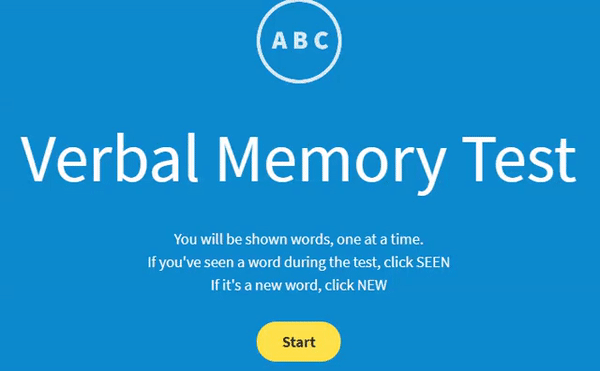

# Humanbenchmark Helper

A simple script that 'helps' the user in in the increasingly hard challenging getting a higher score than their peers in the word memory test hosted on [HumanBenchMark](https://www.humanbenchmark.com/tests/verbal-memory).

## How does the minigame work?
The idea of the minigame is that a word will appear on the screen. If you believe that the word has not appeared before you click new, if you believe that the word as already appeared you click seen. If you answer 3 of these incorrectly you lose. 

## How does this script help the user?
This script takes away all effort needed by the user and blasts through each level with ease. It uses [Google Tesseract](https://opensource.google/projects/tesseract) with python to automate the entire process and achieve perfect scores.

The script first takes a screenshot of the word, then tesseract coverts that into text where python easily stores it in a list. It then checks if the word has appeared before and depending on that it chooses the correct answer.

## Installation/Requirements

This script uses a number of non standard modules, to use the script you will need to perform the following commands:

`pip install pynput`

`pip install pyscreenshot`

`pip install pytesseract`

You will also need to download Google's [Tesseract OCR](https://github.com/tesseract-ocr/tesseract/wiki#installation) and add it to your system path. The module pytesseract is simply a python wrapper for the real program.

After this you will need to set up the webpage for use by doing the following:
1. Navigate [the verbal memory test](https://www.humanbenchmark.com/tests/verbal-memory) webpage.
2. Set the window to fullscreen.
3. Run the script and input what level you would like to obtain.
4. Sit back and enjoy
